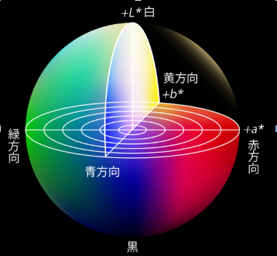

# Wood_Degradation_Color

### Analysis of color change from surface to interior due to wood deterioration
Since discoloration due to wood deterioration seems to be greatly influenced by extracted components, it would be difficult to predict deterioration based on color alone. 
It would be nice if changes in lignin, cellulose, and hemicellulose were directly reflected in the color, but reality is more complicated. 
This is my first time writing a README, but it's clear that this isn't what I should write. 
I hope this repository has been useful to someone.

- I packed too much content into 03_Results.ipynb, which is causing it to load slowly. Lesson learned...

### License

