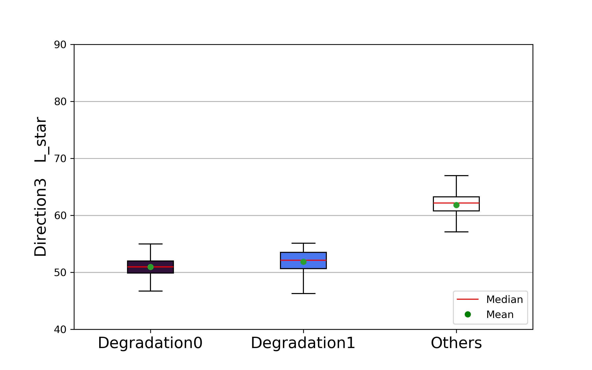

# 劣化による表面から内部にかけての色変化の解析    Analysis of color change from surface to interior due to wood degradation

## 背景   Background

長期間を経た木材の劣化についての既往研究は、表面で迅速に進む**気象劣化**と、気象劣化を免れた内部で緩やかに進む**経年変化**に分けて考えられます。（下図） 
Existing research on the degradation of wood over time can be divided into two categories: **weather degradation**, which is rapid at the surface, and **ageing**, which is gradual inside the wood that has been spared from weather degradation.  
   
それぞれについての蓄積はありますが、これらの**二つを連続的に把握する**ような研究はほとんど行われていません。 
そのため、本研究では、古材の表面から内部にかけての色変化を面的に分析し、劣化による変化を定量的に把握しました。  
Although there is a body of work on each, few studies have been done to **grasp** these two consecutively. 
Therefore, in this study, I conducted a 2D analysis of the color changes from the surface to the interior of aged wood in order to quantitatively assess the changes caused by degradation. 
 
木材は長期間の使用に伴い、その色をはじめとするさまざまな特性が変化します。 
この色変化の測定は、木材の劣化を定量的に評価するための有効な手段となる可能性があります。 
さらに、他の特性との関係を調べることで、木材の劣化を非破壊的に測定するための指標として活用できる可能性があります。 
As wood is used over time, its color and many other properties change.   
Measurement of this color change could be an effective means of quantitatively evaluating wood degradation.   
Furthermore, by examining the relationship with other properties, it could be used as a nondestructive measure of wood degradation.
## 目的    Objective
劣化領域の検出と表面劣化の影響を受けた距離の定量化 
Detection of degradated areas and quantification of distances affected by degradation from surface

## 試料について   About Materials
  
試料として宮城県にある**瑞巌寺**というお寺の柱材を用いました。 
樹種はヒノキで、年輪年代法により最外年輪年代が**1574**年だと、判明しています。 
このように各方向に 1 ~ 4 の番号を付けています。 
The sample was a pillar wood from **Zuiganji Temple** in Miyagi Prefecture, Japan.   
The species is Hinoki, and the outermost ring age was determined to be **1574*** by dendrochronology.   
Each direction is numbered 1 ~ 4.  
 
文分化財建造物保存技術協会編著（2018）国宝瑞巌寺本堂ほか7棟保存修理工事報告書  
ここで取り扱った試料は柱材の根元の部分で、**赤丸**の位置で用いられていました。 
測色に用いる試験体として以下の図のように、L方向に約50mm、T方向に2mm、R方向に髄まで切削し、**まさ目板の試験体**を作成しました。 
The sample handled here was used at the base of the column wood, at the position indicated by the **red circle**. 
As a test specimen for colorimetry, a **Straight grain specimen** was created by cutting approximately 50 mm in the L direction, 2 mm in the T direction, and up to the marrow in the R direction, as shown in the following figure.  

## 測色   Color Measurement
表面から内部にかけて劣化による変色の**グラデーション**が目視で確認されたため、イメージング分光装置（Imspector V8E、JFEテクノリサーチ）を用いて精密に色を測定しました。 
試験体のR方向がステージの移動方向と一致するように設置し、**分解能0.06mm/pixel**で、色データを**Lab表色系**(＊)の色彩値として取得しました。 
Since **gradation** of discoloration due to degradation was visually observed from the surface to the interior, the color was precisely measured using an imaging spectrometer (Imspector V8E, JFE Techno Research).   
The specimen was set up so that the R direction of the specimen was aligned with the movement direction of the stage, and color data was acquired as color values in the **Lab color space**(*) with a **resolution of 0.06 mm/pixel**.   

- (＊)**Lab表色系** Lab Color Space

https://www.konicaminolta.jp/instruments/knowledge/color/section2/2-02/  
Lab表色系は、三次元空間で任意の色を表す表色系です。 
The Lab color space is a color system that represents any color in three-dimensional space.  

## 分析結果   Results
### Lab の可視化   Lab Visualization
L_star をグレースケールで、a_star, b_star をそれぞれ赤と青の濃淡で表している。 
以下の図から、表面からの劣化の影響により特に明度 L_star が減少していることがわかります。 
L_star is shown in grayscale, and a_star and b_star are shown in shades of red and blue, respectively.   
The following figure shows that the brightness L_star is particularly reduced due to the effects of degradation from the surface.  
  
  
  

- 方向ごとの色むらを無視するために標準化
- Standardized to ignore color irregularities in each direction  

**$L_{star} [standardized]$**  
 
**$a_{star} [standardized]$**  
 
**$b_{star} [standardized]$**  
 

### 表面劣化の影響を受けたグループを探す   Look for groups affected by deterioration from the surface.
探索を容易にするために（探索する範囲を狭める）、以下のように8つのクラスに分けた。 
To make the search easier(and narrow the scope to be explored), I have divided it into eight classes as follows.  

$A = L_{star} [standardized] < 0$

$B = a_{star} [standardized] < 0$

$C = b_{star} [standardized] < 0$

- **class0**: $A \cap B \cap C$ 
- **class1**: $A \cap \bar{B} \cap C$
- **class2**: $A \cap B \cap \bar{C}$
- **class3**: $A \cap \bar{B} \cap \bar{C}$
- **class4**: $\bar{A} \cap B \cap C$
- **class5**: $\bar{A} \cap B \cap \bar{C}$
- **class6**: $\bar{A} \cap \bar{B} \cap C$
- **class7**: $\bar{A} \cap \bar{B} \cap \bar{C}$

### 各クラスの可視化   Visualization of each class
  
表面劣化の影響を受けているのか、表面付近では **Class 0**, **Class 1** が優位になっているように見える。 
特に **Class 0**は表面劣化の影響を強く受けていそうだ。 
It appears that **Class 0** and **Class 1** are predominant near the surface, perhaps influenced by degradation from surface.   
In particular, **Class 0** seems to be strongly affected.
#### Memo
- **Class 0** : $L_{star}[standardized] < 0  \cap  a_{star}[standardized] < 0  \cap  b_{star}[standardized] < 0$
- **Class 1** : $L_{star}[standardized] < 0  \cap  a_{star}[standardized] \geq 0  \cap  b_{star}[standardized] < 0$

### 各クラスのデータ分布を密度曲線 (KDE) を用いて可視化   Visualize data distribution for each class using Kernel Density Estimate  

- $L_{star} [standardized]$ の密度曲線を個別にみてみる   Let's look at the KDE for L_star [standardized] individually

  

- $L_{star}[standardized]$ の一部のクラス（ **Class 0** と **Class 1** ）に複数のピークが見られる。すなわち、ヒノキ本来の色のばらつきから離れた集団が存在すると考え、KMeansを用いてクラスタリングした。  

Multiple peaks were observed in some classes of $L_{star}[standardized]$ (**Class 0** and **Class 1**). 
This suggests the existence of subgroups that deviate from the original color variation of Hinoki. 
Therefore, clustering was performed using KMeans. 

 

この密度曲線上にKMeansによる決定境界をプロットした。上図の赤線の前後で分類している。決定境界よりも $L_{star}[standardized]$ の値が小さいグループを表面劣化の影響を受けたと思われる部分として **Degradation 0** , **Degradation 1** と名付けた。ヒノキ現生材の色分布に関しては`02_Control.ipynb`にまとめている。 
The decision boundary by KMeans is plotted on graphs above. 
The classification is made before and after red line. Groups with smaller values of L_star[standardized] than the decision boundary were named **Degradation 0** , **Degradation 1** as areas that may have been affected by degradation from surface. 
For the color distribution of non-degraded Hinoki, I summarized it in `02_Control.ipynb`.  

### KMeans により分けられた領域の可視化   Visualization of regions divided by KMeans
  
### 表面劣化の影響を受けた距離を決定木を用いて定量化する   Quantify the distance affected by degradation from surface using decision trees
- 深さ 1 の決定木を用いて **ジニ不純度** が最小となるような Distance (**R_direction**) を算出する。
- Calculate Distance ( **R_direction** ) such that **Gini impurity** is minimized using a depth 1 decision tree.
  
  
  
これにより表面劣化の影響を受けた距離を定量化することができた。 
This allowed me to quantify the distance affected by degradation from surface.  

## まとめ   Summary
この分析方法により、表面劣化の影響を受けたと考えられる領域を検出し、表面劣化の影響を受けた距離を定量化することができた。
またこれにより、ヒノキ（おそらく心材部分）は表面劣化の影響によって L_star と b_star が減少することが分かった。なお、a_star に関しては減少した領域と増加した領域が見られた。
決定木により定量化された表面劣化の影響を受けた距離は各方向間で異なることから、ここから当時の日照状況など劣化環境を推測することができると考えられる。また灰色化層（詳しくは`01_Results.ipynb`）についても同様に、水分の影響を反映していると考えられる。 
This method allowed me to detect areas that may have been affected by degradation from surface and to quantify the distance.
And this also revealed that L_star and b_star decreased in the case of Hinoki (presumably the heartwood portion) . For a_star, there were some areas where a_star decreased and increased. 
Since the distance affected by degradation from surface quantified by the decision tree differs in each direction, it is possible to infer the degradation environment, such as sunlight conditions at that time, from this information.  
Similarly, the graying layer (details for `01_Results.ipynb`) is thought to reflect the effect of moisture.
## 問題点   Issues
- この分析方法では最表面部分の劣化を検出できていない。この部分は劣化により低分子化した成分が水分により溶脱した層、**灰色化層** と考えらる。灰色化層には、 $L_{star}[standardized]$ が正のクラス（Class 4, 5）が含まれるため、閾値一つでは分けることができなかった。  This analysis method did not detect degradation on the top surface. This area is considered to be the **graying layer**, which is a layer of low-molecular-weight components dissolved by moisture. Since the graying layer includes classes (Class 4, 5) with a positive $L_{star}[standardized]$, it could not be separated by a single threshold.
- 色変化が他の特性、力学的特性などと、どのように対応するかが不明。（曲げヤング率とブリネル硬さは表面と内部でほぼ変化しない。強度に関してはまだわからないが、さすがに変化していると思う。）  It is unclear how the color change corresponds to other properties, mechanical properties, etc. (Young's modulus in bending and Brinell hardness are virtually unchanged between the surface and the interior. As for strength, it's still unknown, but I hope it has indeed changed..)
- 色変化は抽出成分による影響も大きく、リグニン、セルロース、ヘミセルロースの変化が直接反映されるわけではないので、色変化の原因を特定することが難しい。  Since the color change is largely influenced by extracted components and does not directly reflect changes in lignin, cellulose, or hemicellulose, it is difficult to identify the cause of the color change.

## Appendix
Visualization of the Lab values of the divided regions by the previous analysis methods
### Regions
`navy`: **Degradation 0**, `skyblue`: **Degradation 1**, `white`: **Others**
  

### Boxplot L_star
**Direction 1** (See `About Materials` for Direction number)   
  
**Direction 2**   
  
**Direction 3**   
  
**Direction 4**   

### Boxplot a_star
**Direction 1**   
  
**Direction 2**   
  
**Direction 3**   
  
**Direction 4**   

### Boxplot b_star
**Direction 1**    
  
**Direction 2**   
  
**Direction 3**   
  
**Direction 4**   

## License
This project is licensed under the MIT License.  
See the [LICENSE](LICENSE) file for more details.

